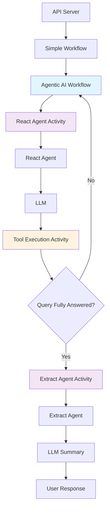

# Durable AI Agent - A Fundamental Evolution in AI Agents

The durable-ai-agent represents a fundamental evolution in building reliable AI agents. By combining DSPy's context engineering, Temporal's durable execution, and modern MCP integration, it demonstrates how to build production-ready agentic AI applications with fully automated agent-driven tool execution that can handle complex, multi-step reasoning tasks while maintaining reliability and transparency.

This project goes beyond traditional AI applications that rely on brittle prompt engineering and fragile execution patterns. Instead, it showcases a robust architecture where AI agents don't just generate responses—they reason through problems systematically, select and execute appropriate tools autonomously, and maintain their state even through system failures or long-running operations. Every decision is traceable, every action is durable, and every interaction builds upon previous context in a way that mirrors human problem-solving.

The power comes from bringing together three cutting-edge technologies:
- **DSPy's Context Engineering**: Move beyond brittle prompts to structured, type-safe reasoning with declarative signatures and automatic optimization
- **Temporal's Durable Execution**: Ensure your AI agents survive failures, restarts, and long-running operations with automatic state persistence and retry logic
- **Modern MCP Integration**: Seamlessly connect to tools and services with both stdio and HTTP transports, enabling rich tool ecosystems

The result is an AI system that not only thinks and reasons like modern LLMs but also executes reliably like production software—bridging the gap between experimental AI and enterprise-ready applications. This is what makes it possible to deploy AI agents that can be trusted with real-world tasks, from analyzing agricultural conditions to orchestrating complex multi-step workflows.

**Custom Built Agentic AI Loop with DSPy**: The system implements a fully custom agentic workflow modeled after DSPy ReAct patterns (see [DSPy Overview](DSPy%20Overview.md)). When triggered, it executes the Reason-Act pattern where the agent iteratively reasons about problems, selects appropriate tools, executes actions, and observes results in a continuous loop until tasks are complete. The system collects all action results throughout the trajectory and uses a separate extract agent to synthesize a final answer from the accumulated observations.

**Multi-Step Reasoning**: Each iteration includes structured thought-action-observation cycles. The agent builds a comprehensive trajectory of all steps taken, allowing for complex multi-turn reasoning where each decision builds on previous observations and results.

**Tool Integration**: The system includes both traditional and MCP-enabled tools. The precision agriculture tool set provides weather forecasting, historical data, and agricultural conditions through:
- **Traditional Tools**: Direct API calls to Open Meteo
- **MCP Tools**: Same functionality via Model Context Protocol servers, enabling distributed execution and better scalability

**Temporal Foundation**: Provides durable execution with automatic retry, state persistence, and fault tolerance. Workflows can be long-running conversations that survive system restarts.

> **Note**: For detailed architecture information and how this project represents a significant evolution over traditional AI applications, see [DURABLE_AI_OVERVIEW.md](DURABLE_AI_OVERVIEW.md).

## Sample Output

- [Agentic Loop Sample Run](Agentic%20Loop%20Sample%20Run.md) - Example of the full agentic reasoning process
- [Agriculture Query Samples](Agriculture%20Query%20Samples.md) - Sample agricultural weather queries and responses
- [MCP Proxy Server Routing](MCP%20Proxy%20Server%20Routing.md) - How the proxy routes between weather services
- [View Client Screenshot](sample_client_screen_shoot.png) - Visual interface demonstration

## Quick Start

### Prerequisites
- Docker and Docker Compose installed
- Python 3.10+ (for local development)
- Node.js 20+ (for frontend development)
- Poetry (for Python dependency management)

**System Components:**
- **Workflow**: Durable workflows that track state and orchestrate agentic AI loops
- **Activities**: Atomic units including React agent iterations, tool execution, and result extraction
- **API**: FastAPI server for workflow management and chat interface
- **Frontend**: React UI for chat interaction
- **Worker**: Processes Temporal workflows and activities with integrated agentic loops


### Running the Complete System (Recommended)

1. **Set up environment files**
   ```bash
   cp .env.example .env
   cp worker.env .worker.env
   ```
   **Note**: Make sure `.worker.env` is copied from `worker.env` and is not in the samples. The existing `.env` file should remain as is.

2. **Start all services with the convenience script**
   ```bash
   ./run_docker.sh
   ```

3. **Access the applications**
   - 🌐 **Frontend (Chat UI)**: http://localhost:3000
   - 📡 **API Server**: http://localhost:8000
   - 📚 **API Documentation**: http://localhost:8000/docs
   - ⚙️ **Temporal UI**: http://localhost:8080

### What Gets Started

Docker Compose will start the following services:
- **PostgreSQL**: Database for Temporal
- **Temporal Server**: Workflow orchestration engine
- **Temporal UI**: Web interface for monitoring workflows
- **API Server**: FastAPI backend at port 8000
- **Worker**: Processes Temporal workflows and activities
- **Frontend**: React chat interface at port 3000

### Using the Chat Interface

1. Open http://localhost:3000 in your browser - it generates a random user name for now.
2. Type a message in the input field
3. The system supports several types of messages of magic string messages (currently hard-coded in workflows/simple_agent_workflow.py):
   - **"weather:"** - For example try "weather: Are conditions good for planting corn in Ames, Iowa?".  Triggers the full agentic workflow with a fully custom agentic loop modeled off DSPy React. This includes multi-step reasoning, tool selection, action execution, and result synthesis. Currently it is hard-coded to use the tool set from the worker.env configuration. In the future, the first call could be a classification agent which decides which tool set(s) to use.
   - **"historical"** - Calls the weather historical activity for past weather data
   - **"agriculture"** - Calls the agricultural activity for farming conditions
   - **Any other message** - Defaults to the find_events activity

4. The workflow ID and status are displayed in the header
5. Click "New Conversation" to start a fresh workflow

## Architecture

The system implements a multi-layered architecture that combines durable workflow orchestration with intelligent agentic reasoning:



### Key Components

- **API Server**: FastAPI endpoint handling chat requests
- **Simple Workflow**: Temporal workflow orchestrating the entire process - will be replace with a more complex agentic workflow that does query classification and selects the appropriate agentic workflow.
- **Agentic AI Workflow**: Custom DSPy-based reasoning loop with multi-step execution
- **React Agent Activity**: Multi-iteration of the reason-act cycle with tool selection fed to the Tool Execution Activity
- **Tool Execution Activity**: Tool execution for agent tool calling based on reasoning of the React Agent
- **Extract Agent Activity**: Final synthesis and summary generation from the complete trajectory of actions and observations

### Multi-Step Reasoning Process

1. User message triggers the agentic workflow
2. React Agent performs iterative reasoning cycles:
   - **Reason**: Analyze current state and determine next action
   - **Act**: Select and execute appropriate tools
   - **Extract**: Collect results and observations and provide an observation
   - **Observe**: The final answer to the users query.
3. Loop continues until query is fully answered
4. Extract Agent synthesizes final response from complete trajectory

### MCP (Model Context Protocol) Integration

The project includes a complete MCP implementation with three specialized weather services, all managed through Poetry for seamless integration.

#### MCP Servers

Three specialized weather services using FastMCP:
- **Forecast Server** (port 7778): Weather forecasts up to 7 days
- **Historical Server** (port 7779): Historical weather data with 5-day delay
- **Agricultural Server** (port 7780): Agricultural conditions and soil moisture

#### Running MCP Servers

```bash
# Run all servers at once (recommended for development)
poetry run poe mcp-all
# Press Ctrl+C to stop all servers when running mcp-all

# Or run individual servers
poetry run poe mcp-forecast      # Forecast server on port 7778
poetry run poe mcp-historical    # Historical server on port 7779
poetry run poe mcp-agricultural  # Agricultural server on port 7780

# Stop all MCP servers
poetry run poe mcp-stop

# Servers are also available via Docker Compose
docker-compose --profile weather_proxy up  # Unified proxy on port 8001
```

#### Testing MCP Integration

```bash
# Run all MCP integration tests (direct Python programs)
poetry run python integration_tests/run_integration_tests.py

# Run individual integration tests
poetry run python integration_tests/test_stdio_client.py     # Test stdio transport
poetry run python integration_tests/test_http_client.py      # Test HTTP transport (requires server)
poetry run python integration_tests/test_proxy_integration.py # Test unified proxy

# Run tests without HTTP (if servers aren't running)
poetry run python integration_tests/run_integration_tests.py --no-http
```

The integration tests are implemented as direct Python programs (not pytest) to avoid complexity with async test runners and provide clearer error messages.

#### MCP Tool Integration

The system now includes MCP-enabled tools that seamlessly integrate with the agentic workflow:

- **WeatherForecastMCPTool**: Weather forecasts via MCP (`get_weather_forecast_mcp`)
- **HistoricalWeatherMCPTool**: Historical weather data via MCP (`get_historical_weather_mcp`)
- **AgriculturalWeatherMCPTool**: Agricultural conditions via MCP (`get_agricultural_conditions_mcp`)

These tools:
- Coexist with traditional tools in the tool registry
- Are automatically routed to the MCPExecutionActivity
- Support mock mode via `TOOLS_MOCK=true` environment variable
- Provide the same functionality as traditional tools but through MCP servers

### Proxy Architecture

The proxy uses FastMCP's built-in features for elegant service composition:
- `FastMCP.mount()` to combine multiple services into a unified interface
- `proxy.run(transport="streamable-http")` for HTTP transport protocol
- Automatic session management and protocol handling
- Full MCP protocol support with minimal code overhead

This simple approach reduces complexity while providing complete functionality - the entire proxy implementation is about 20 lines of code compared to hundreds in traditional approaches.

## Development Setup

### Prerequisites
- Docker and Docker Compose
- Python 3.10+ with Poetry
- Node.js 20+ (for frontend)

### Local Development

```bash
# Install dependencies
poetry install

# Start Temporal (requires Temporal CLI)
temporal server start-dev

# Start worker, API, and frontend in separate terminals
poetry run python scripts/run_worker.py
poetry run python api/main.py
cd frontend && npm install && npm run dev
```


## API Endpoints

- `POST /chat` - Start a workflow with a message
- `GET /workflow/{workflow_id}/status` - Get workflow status  
- `GET /workflow/{workflow_id}/query` - Query workflow state
- `GET /health` - Health check
- `GET /docs` - API documentation

## Project Structure

```
durable-ai-agent/
├── workflows/          # Temporal workflows
├── activities/         # Temporal activities with MCP integrations
│   ├── mcp_utils.py           # Common MCP utilities
│   ├── weather_forecast_activity.py    # Weather forecast activity
│   ├── weather_historical_activity.py  # Historical weather activity
│   ├── agricultural_activity.py        # Agricultural conditions activity
│   └── find_events_activity.py         # Legacy event finding activity
├── tools/             # Tool implementations
├── models/            # Data models
├── shared/            # Shared utilities
├── worker/            # Worker process
├── api/               # API server
├── mcp_proxy/         # Unified MCP proxy server
│   ├── simple_proxy.py       # Main proxy implementation
│   ├── run_docker.sh         # Docker compose startup script
│   ├── test_docker.sh        # Docker testing script
│   └── stop_docker.sh        # Docker cleanup script
├── mcp_servers/       # MCP server implementations
│   ├── forecast_server.py     # Weather forecast server
│   ├── historical_server.py   # Historical weather server
│   ├── agricultural_server.py # Agricultural conditions server
│   ├── api_utils.py          # Shared API utilities
│   ├── models.py             # Pydantic models
│   └── utils/                # Utility modules
├── frontend/          # React UI
│   ├── src/
│   │   ├── components/   # React components
│   │   ├── hooks/        # Custom React hooks
│   │   └── services/     # API client
│   └── Dockerfile        # Frontend container
├── integration_tests/ # Integration test suites
│   └── test_proxy_integration.py  # Proxy integration tests
├── docker-compose.yml  # Service orchestration with profiles
└── tests/             # Test suites
```

### Integration Tests

The main integration test is a plain Python program:

```bash
poetry run python integration_tests/test_weather_api.py
```

## Proxy Testing

The MCP proxy server provides a unified endpoint for multiple weather services. Here's how to run and test it.

### Running the Proxy

**Start the proxy server**:
```bash
# From the project root directory
python -m mcp_proxy.simple_proxy

# The proxy will start on http://localhost:8000/mcp
# (Use port 8001 if 8000 is in use)
```

### Testing the Proxy

**Quick test script**:
```bash
# Run the simple test script
python mcp_proxy/test_simple_proxy.py
```

### Docker Compose Profiles

The project uses Docker Compose profiles to manage different service configurations:

**Weather Proxy (Default)**:
```bash
# Start the unified weather proxy (includes forecast, current, historical services)
docker-compose --profile weather_proxy up -d weather-proxy

# Or use the convenience script
./mcp_proxy/run_docker.sh

# Access proxy at: http://localhost:8001/mcp
```

**Individual Forecast Service**:
```bash
# Start only the forecast MCP server
docker-compose --profile forecast up -d forecast-mcp

# Access forecast service at: http://localhost:7778/mcp
```

### Docker Testing

**Simple scripts for Docker operations**:
```bash
# Navigate to the proxy directory
cd mcp_proxy/

# Build and run the unified weather proxy with docker-compose
./run_docker.sh

# Test the running proxy
./test_docker.sh

# Stop and remove containers
./stop_docker.sh
```

The scripts handle:
- `run_docker.sh` - Starts the weather proxy using docker-compose profile
- `test_docker.sh` - Tests the proxy with MCP client calls
- `stop_docker.sh` - Stops and removes containers with docker-compose


