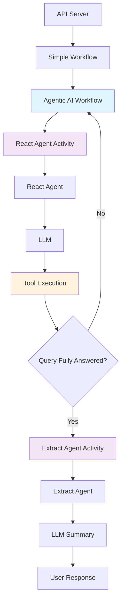

# Durable AI Agent

A demonstration of **Custom Built Agentic AI Loop with DSPy and Multi-Step Reasoning** using Temporal Workflows for durable execution. This project shows how to build reliable, persistent AI agents that can reason, plan, and execute actions while maintaining state across restarts and failures.

## Overview

**Custom Built Agentic AI Loop with DSPy**: The system implements a fully custom agentic workflow modeled after DSPy ReAct patterns (see [DSPy System Prompt](https://github.com/retroryan/dspy-system-prompt)). When triggered, it executes the Reason-Act pattern where the agent iteratively reasons about problems, selects appropriate tools, executes actions, and observes results in a continuous loop until tasks are complete. The system collects all action results throughout the trajectory and uses a separate extract agent to synthesize a final answer from the accumulated observations.

**Multi-Step Reasoning**: Each iteration includes structured thought-action-observation cycles. The agent builds a comprehensive trajectory of all steps taken, allowing for complex multi-turn reasoning where each decision builds on previous observations and results.

**Tool Integration**: The system includes precision agriculture tool sets that currently call the Open Meteo API directly. MCP (Model Context Protocol) servers are already built and will be set up shortly for enhanced tool integration.

**Temporal Foundation**: Provides durable execution with automatic retry, state persistence, and fault tolerance. Workflows can be long-running conversations that survive system restarts.

## Quick Start

### Prerequisites
- Docker and Docker Compose installed
- Python 3.10+ (for local development)
- Node.js 20+ (for frontend development)
- Poetry (for Python dependency management)

**System Components:**
- **Workflow**: Durable workflows that track state and orchestrate agentic AI loops
- **Activities**: Atomic units including React agent iterations, tool execution, and result extraction
- **API**: FastAPI server for workflow management and chat interface
- **Frontend**: React UI for chat interaction
- **Worker**: Processes Temporal workflows and activities with integrated agentic loops


### Running the Complete System (Recommended)

1. **Set up environment files**
   ```bash
   cp .env.example .env
   cp worker.env .worker.env
   ```
   **Note**: Make sure `.worker.env` is copied from `worker.env` and is not in the samples. The existing `.env` file should remain as is.

2. **Start all services with the convenience script**
   ```bash
   ./run_docker.sh
   ```

3. **Access the applications**
   - 🌐 **Frontend (Chat UI)**: http://localhost:3000
   - 📡 **API Server**: http://localhost:8000
   - 📚 **API Documentation**: http://localhost:8000/docs
   - ⚙️ **Temporal UI**: http://localhost:8080

### What Gets Started

Docker Compose will start the following services:
- **PostgreSQL**: Database for Temporal
- **Temporal Server**: Workflow orchestration engine
- **Temporal UI**: Web interface for monitoring workflows
- **API Server**: FastAPI backend at port 8000
- **Worker**: Processes Temporal workflows and activities
- **Frontend**: React chat interface at port 3000

### Using the Chat Interface

1. Open http://localhost:3000 in your browser
2. Type a message in the input field
3. The system supports several types of messages (currently hard-coded in workflows/simple_agent_workflow.py):
   - **"weather"** - Triggers the full agentic workflow with a custom agentic loop modeled off DSPy React. This agent can reason through complex weather-related queries, select appropriate tools, and execute multi-step analysis.
   - **"historical"** - Calls the weather historical activity for past weather data
   - **"agriculture"** - Calls the agricultural activity for farming conditions
   - **Any other message** - Defaults to the find_events activity (legacy behavior)

**Magic Word**: The word "weather" triggers the full agentic workflow with a fully custom agentic loop modeled off DSPy React. This includes multi-step reasoning, tool selection, action execution, and result synthesis. Currently it is hard-coded to use the tool set from the worker.env configuration. In the future, the first call could be a classification agent which decides which tool set(s) to use.

4. The workflow ID and status are displayed in the header
5. Click "New Conversation" to start a fresh workflow

## Architecture

The system implements a multi-layered architecture that combines durable workflow orchestration with intelligent agentic reasoning:



### Key Components

- **API Server**: FastAPI endpoint handling chat requests
- **Simple Workflow**: Temporal workflow orchestrating the entire process - will be replace with a more complex agentic workflow that does query classification and selects the appropriate agentic workflow.
- **Agentic AI Workflow**: Custom DSPy-based reasoning loop with multi-step execution
- **React Agent Activity**: Multi-iteration of the reason-act cycle with tool selection fed to the Tool Execution Activity
- **Tool Execution Activity**: Tool execution for agent tool calling based on reasoning of the React Agent
- **Extract Agent Activity**: Final synthesis and summary generation from the complete trajectory of actions and observations

### Multi-Step Reasoning Process

1. User message triggers the agentic workflow
2. React Agent performs iterative reasoning cycles:
   - **Reason**: Analyze current state and determine next action
   - **Act**: Select and execute appropriate tools
   - **Extract**: Collect results and observations and provide an observation
   - **Observe**: The final answer to the users query.
3. Loop continues until query is fully answered
4. Extract Agent synthesizes final response from complete trajectory

## Development Setup

### Prerequisites
- Docker and Docker Compose
- Python 3.10+ with Poetry
- Node.js 20+ (for frontend)

### Local Development

```bash
# Install dependencies
poetry install

# Start Temporal (requires Temporal CLI)
temporal server start-dev

# Start worker, API, and frontend in separate terminals
poetry run python worker/main.py
poetry run python api/main.py
cd frontend && npm install && npm run dev
```


## API Endpoints

- `POST /chat` - Start a workflow with a message
- `GET /workflow/{workflow_id}/status` - Get workflow status  
- `GET /workflow/{workflow_id}/query` - Query workflow state
- `GET /health` - Health check
- `GET /docs` - API documentation

## Project Structure

```
durable-ai-agent/
├── workflows/          # Temporal workflows
├── activities/         # Temporal activities with MCP integrations
│   ├── mcp_utils.py           # Common MCP utilities
│   ├── weather_forecast_activity.py    # Weather forecast activity
│   ├── weather_historical_activity.py  # Historical weather activity
│   ├── agricultural_activity.py        # Agricultural conditions activity
│   └── find_events_activity.py         # Legacy event finding activity
├── tools/             # Tool implementations
├── models/            # Data models
├── shared/            # Shared utilities
├── worker/            # Worker process
├── api/               # API server
├── mcp_proxy/         # Unified MCP proxy server
│   ├── simple_proxy.py       # Main proxy implementation
│   ├── run_docker.sh         # Docker compose startup script
│   ├── test_docker.sh        # Docker testing script
│   └── stop_docker.sh        # Docker cleanup script
├── frontend/          # React UI
│   ├── src/
│   │   ├── components/   # React components
│   │   ├── hooks/        # Custom React hooks
│   │   └── services/     # API client
│   └── Dockerfile        # Frontend container
├── integration_tests/ # Integration test suites
│   └── test_proxy_integration.py  # Proxy integration tests
├── docker-compose.yml  # Service orchestration with profiles
└── tests/             # Test suites
```

### Integration Tests

The main integration test is a plain Python program:

```bash
poetry run python integration_tests/test_weather_api.py
```

## Proxy Testing

The MCP proxy server provides a unified endpoint for multiple weather services. Here's how to run and test it.

### Running the Proxy

**Start the proxy server**:
```bash
# From the project root directory
python -m mcp_proxy.simple_proxy

# The proxy will start on http://localhost:8000/mcp
# (Use port 8001 if 8000 is in use)
```

### Testing the Proxy

**Quick test script**:
```bash
# Run the simple test script
python mcp_proxy/test_simple_proxy.py
```

This will:
- Connect to the proxy at http://localhost:8000/mcp
- List all available tools (8 tools from 3 services)
- Test calling tools from each service
- Display the results

**Expected output**:
```
Connecting to proxy at http://localhost:8000/mcp...
✅ Connected to proxy!

Found 8 tools:
  - forecast_get_forecast: Get weather forecast
  - forecast_get_hourly_forecast: Get hourly weather forecast
  - current_get_current_weather: Get current weather
  - current_get_temperature: Get current temperature
  - current_get_conditions: Get current conditions
  - historical_get_historical_weather: Get historical weather
  - historical_get_climate_average: Get climate average
  - historical_get_weather_records: Get weather records

Testing tool calls...
Current weather result: {...}
Forecast result: {...}
Historical result: {...}
```

### Docker Compose Profiles

The project uses Docker Compose profiles to manage different service configurations:

**Weather Proxy (Default)**:
```bash
# Start the unified weather proxy (includes forecast, current, historical services)
docker-compose --profile weather_proxy up -d weather-proxy

# Or use the convenience script
./mcp_proxy/run_docker.sh

# Access proxy at: http://localhost:8001/mcp
```

**Individual Forecast Service**:
```bash
# Start only the forecast MCP server
docker-compose --profile forecast up -d forecast-mcp

# Access forecast service at: http://localhost:7778/mcp
```

### Docker Testing

**Simple scripts for Docker operations**:
```bash
# Navigate to the proxy directory
cd mcp_proxy/

# Build and run the unified weather proxy with docker-compose
./run_docker.sh

# Test the running proxy
./test_docker.sh

# Stop and remove containers
./stop_docker.sh
```

The scripts handle:
- `run_docker.sh` - Starts the weather proxy using docker-compose profile
- `test_docker.sh` - Tests the proxy with MCP client calls
- `stop_docker.sh` - Stops and removes containers with docker-compose

### Integration Testing

**Proxy Integration Test**:
```bash
# Start the weather proxy
./mcp_proxy/run_docker.sh

# Run integration tests against the proxy
python integration_tests/test_proxy_integration.py
```

This test verifies:
- ✅ Proxy connection and unified tool listing (8 tools from 3 services)
- ✅ Current weather, forecast, and historical tool calls
- ✅ Connection reuse and multiple sequential operations
- ✅ All services accessible through single endpoint

### Manual Testing with curl

**List all tools**:
```bash
curl -X POST http://localhost:8001/mcp \
  -H "Content-Type: application/json" \
  -d '{"jsonrpc": "2.0", "method": "tools/list", "id": 1}'
```

**Call a specific tool**:
```bash
curl -X POST http://localhost:8001/mcp \
  -H "Content-Type: application/json" \
  -d '{
    "jsonrpc": "2.0",
    "method": "tools/call",
    "params": {
      "name": "forecast_get_forecast",
      "arguments": {"location": "Sydney", "days": 3}
    },
    "id": 2
  }'
```

### Using with MCP Client

```python
from fastmcp.client import Client

async with Client("http://localhost:8001/mcp") as client:
    # List tools
    tools = await client.list_tools()
    
    # Call a tool
    result = await client.call_tool(
        "current_get_current_weather",
        {"location": "Melbourne"}
    )
```

### Proxy Architecture

The proxy uses FastMCP's built-in features:
- `FastMCP.mount()` to combine multiple services
- `proxy.run(transport="streamable-http")` for HTTP transport
- Automatic session management and protocol handling

This simple approach reduces complexity from hundreds of lines to about 20 lines of code while providing full MCP protocol support.