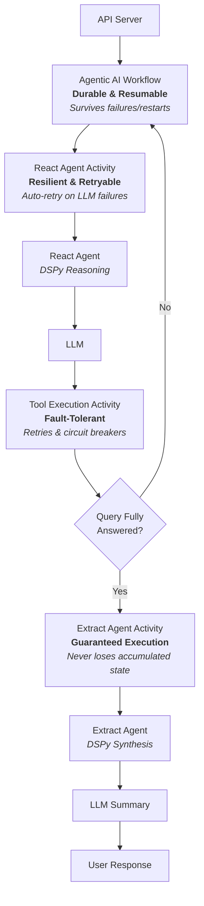

# Durable AI Agent Architecture

## Overview

The durable-ai-agent represents a fundamental evolution in building reliable AI agents. By combining DSPy's context engineering, Temporal's durable execution, and modern MCP integration, it demonstrates how to build production-ready agentic AI applications with fully automated agent-driven tool execution that can handle complex, multi-step reasoning tasks while maintaining reliability and transparency.

This project goes beyond traditional AI applications that rely on brittle prompt engineering and fragile execution patterns. Instead, it showcases a robust architecture where AI agents don't just generate responses—they reason through problems systematically, select and execute appropriate tools autonomously, and maintain their state even through system failures or long-running operations. Every decision is traceable, every action is durable, and every interaction builds upon previous context in a way that mirrors human problem-solving.

The power comes from bringing together three cutting-edge technologies:

- **DSPy's Context Engineering**: Move beyond brittle prompts to structured, type-safe reasoning with declarative signatures and automatic optimization
- **Temporal's Durable Execution**: Ensure your AI agents survive failures, restarts, and long-running operations with automatic state persistence and retry logic
- **Modern MCP Integration**: Seamlessly connect to tools and services with both stdio and HTTP transports, enabling rich tool ecosystems

## Core Architecture: Durable Agentic Loop

We solve the challenge of building reliable AI agents by integrating three cutting-edge technologies to create a resilient architecture that separates thinking from acting:

**Technologies**:

* **Temporal's Durable Execution**: Workflows that maintain state across failures with stateless workers that scale infinitely

* **DSPy's Context Engineering**: Structured, type-safe reasoning with declarative signatures—moving beyond brittle prompt engineering

* **MCP Integration**: Seamless tool orchestration with built-in support for weather forecasting, historical data, and agricultural analysis

**Architecture**:

* **Thinking (DSPy)**: The agent reasons through problems using structured modules

* **Acting (Temporal Activities)**: Tool execution is isolated and independently durable

* **Orchestration (Temporal Workflows)**: The overall process is checkpointed and resumable

This separation ensures transparency, traceability, and resilience to transient failures at any layer.

## Architecture Overview

The architecture separates thinking from acting:
- **Thinking (DSPy)**: The agent reasons through problems using structured modules
- **Acting (Temporal Activities)**: Tool execution is isolated and independently durable
- **Orchestration (Temporal Workflows)**: The overall process is checkpointed and resumable

## Use Cases

### Perfect For

- **Complex Reasoning Tasks**: Multi-step workflows requiring tool orchestration
- **Mission-Critical Agents**: Where automatic recovery is essential
- **Long-Running Operations**: Processes that may take hours or days
- **Cost-Sensitive Workflows**: Expensive LLM operations requiring guaranteed execution

### Example Applications

- **Agricultural Analysis**: Weather forecasting combined with soil conditions
- **Financial Analysis**: Multi-source data synthesis with reliability guarantees
- **Research Automation**: Literature review and analysis workflows
- **Customer Support**: Complex multi-step resolution processes

## Major Features

### 1. DSPy Implementation - From Brittle Prompts to Context Engineering

- Leverages DSPy for structured, type-safe context engineering
- Declarative signatures defining input/output schemas
- Automatic prompt generation and validation
- Domain-specific tool sets with custom signatures
- Programmatic reasoning patterns replacing error-prone prompt engineering
- Type-safe interactions throughout the system

### 2. Custom Agentic Loop with DSPy React

- Sophisticated multi-step reasoning loop inspired by DSPy React
- Thought → Action → Observation cycles with full transparency
- Trajectory-based state management tracking all iterations
- Complete control over each reasoning step for durable execution
- Separate extraction phase to synthesize final answers from trajectories
- Iterative refinement until query is fully answered

The custom agentic loop in `agentic_loop/react_agent.py` implements:
- Stateless agent design for better durability
- Trajectory dictionaries for complete execution history
- Dynamic tool selection based on reasoning
- Graceful error handling and recovery

### 3. Enhanced MCP Client Management

Advanced MCP client (`mcp_client_manager.py`) supporting:
- Both stdio and streaming HTTP connections
- Connection pooling for reuse across tool calls
- FastMCP integration for simpler, more robust implementation
- Dynamic transport selection based on server configuration
- Automatic session lifecycle management
- Support for both local processes and remote HTTP endpoints

### 4. Agriculture MCP Servers

Three new precision agriculture MCP servers in `mcp_servers/` are ready for deployment:
- **agricultural_server.py**: Soil moisture, evapotranspiration, growing conditions
- **forecast_server.py**: Weather forecasting with multiple day predictions
- **historical_server.py**: Historical weather data and climate patterns

All servers feature:
- FastMCP implementation for reliability
- Pydantic models for type safety and validation
- Direct Open-Meteo API integration
- Coordinate optimization (3x faster with lat/long vs location names)
- Structured responses for LLM interpretation

### 5. Additional Architectural Improvements

#### Simplified Architecture
- Removed complex goal/agent selection system
- Replaced with flexible tool registry pattern
- Cleaner separation of concerns

#### Tool Organization
- Reorganized into domain-specific directories
- Added validators and type checking
- Tool registry with dynamic loading
- Mock results support for testing

#### Testing Infrastructure
- Comprehensive integration tests
- Separate test runners for different components
- Docker-based testing environments

#### Docker Strategy
- Modular Docker approach with specialized containers
- Docker profiles for different deployment scenarios
- Separate Dockerfiles for each service
- Better resource isolation

#### Observability
- Structured logging configuration
- Metrics collection
- Activity-level logging
- Workflow state tracking

#### Error Handling
- Better error propagation throughout the system
- Graceful degradation in agentic loop
- Retry policies at activity level
- User-friendly error messages

#### Unique Workflow IDs

Dynamic workflow ID system:
- Auto-generated UUIDs: `f"durable-agent-{uuid.uuid4()}"`
- Client can provide custom workflow_id
- WorkflowService properly manages lifecycle
- Supports concurrent conversations from multiple clients
- Workflow state isolation between clients
- Proper workflow existence checking and reuse

#### Frontend Updates for Workflow IDs

Frontend API client (`frontend/src/services/api.js`):
- Passes workflow_id in all requests
- Supports workflow status queries
- Can maintain conversation continuity across sessions
- Workflow ID displayed in UI header
- "New Conversation" button to start fresh workflows

## Architecture Patterns

### Durable Execution Pattern
The system leverages Temporal's durable execution model:
- Workflows maintain state across restarts
- Activities are automatically retried on failure
- Long-running conversations survive system restarts
- State is persisted at each step

### Tool Registry Pattern
Dynamic tool management system:
- Tools are registered at runtime
- Domain-specific tool sets
- Easy addition of new tools
- Type-safe tool execution

### Trajectory-Based Reasoning
Complete history of agent reasoning:
- Every thought, action, and observation recorded
- Enables debugging and transparency
- Supports complex multi-turn reasoning
- Used for final answer synthesis

## Future Enhancements

1. **Classification Agent**: First step to determine which tool set(s) to use
2. **Multi-Tool Set Support**: Combining tools from different domains
3. **Streaming Responses**: Real-time updates during long operations
4. **Enhanced Metrics**: Detailed performance tracking
5. **Tool Versioning**: Support for multiple tool versions

## Conclusion

The durable-ai-agent represents a fundamental evolution in building reliable AI agents. By combining DSPy's context engineering, Temporal's durable execution, and modern MCP integration, it demonstrates how to build production-ready agentic AI applications with fully automated agent-driven tool execution that can handle complex, multi-step reasoning tasks while maintaining reliability and transparency.