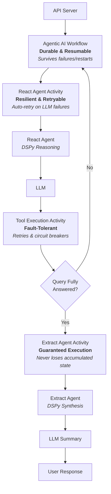

# Durable Agentic Architecture

This architecture demonstrates how to build production-ready AI agents by integrating three cutting-edge technologies:

1. **Temporal's Durable Execution**: Workflows that maintain state across failures with stateless workers that scale infinitely
2. **DSPy's Context Engineering**: Structured, type-safe reasoning with declarative signatures—moving beyond brittle prompt engineering
3. **MCP Integration**: Seamless tool orchestration with built-in support for weather forecasting, historical data, and agricultural analysis

## Architecture Overview

The architecture separates thinking from acting:
- **Thinking (DSPy)**: The agent reasons through problems using structured modules
- **Acting (Temporal Activities)**: Tool execution is isolated and independently durable
- **Orchestration (Temporal Workflows)**: The overall process is checkpointed and resumable