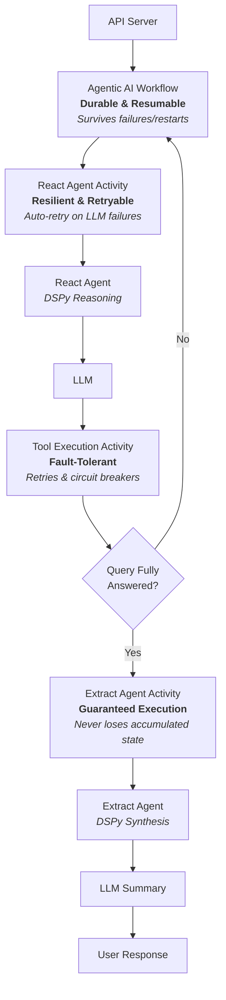

# Durable AI Agent Architecture

## Overview

The durable-ai-agent represents a fundamental evolution in building reliable AI agents. By combining DSPy's context engineering, Temporal's durable execution, and modern MCP integration, it demonstrates how to build production-ready agentic AI applications with fully automated agent-driven tool execution that can handle complex, multi-step reasoning tasks while maintaining reliability and transparency.

This project goes beyond traditional AI applications that rely on brittle prompt engineering and fragile execution patterns. Instead, it showcases a robust architecture where AI agents don't just generate responses—they reason through problems systematically, select and execute appropriate tools autonomously, and maintain their state even through system failures or long-running operations. Every decision is traceable, every action is durable, and every interaction builds upon previous context in a way that mirrors human problem-solving.

The power comes from bringing together three cutting-edge technologies:

- **DSPy's Context Engineering**: Move beyond brittle prompts to structured, type-safe reasoning with declarative signatures and automatic optimization
- **Temporal's Durable Execution**: Ensure your AI agents survive failures, restarts, and long-running operations with automatic state persistence and retry logic
- **Modern MCP Integration**: Seamlessly connect to tools and services with both stdio and HTTP transports, enabling rich tool ecosystems

## Core Architecture: Durable Agentic Loop

We solve the challenge of building reliable AI agents by integrating three cutting-edge technologies to create a resilient architecture that separates thinking from acting:

**Technologies**:

* **Temporal's Durable Execution**: Workflows that maintain state across failures with stateless workers that scale infinitely

* **DSPy's Context Engineering**: Structured, type-safe reasoning with declarative signatures—moving beyond brittle prompt engineering

* **MCP Integration**: Seamless tool orchestration with built-in support for weather forecasting, historical data, and agricultural analysis

**Architecture**:

* **Thinking (DSPy)**: The agent reasons through problems using structured modules

* **Acting (Temporal Activities)**: Tool execution is isolated and independently durable

* **Orchestration (Temporal Workflows)**: The overall process is checkpointed and resumable

This separation ensures transparency, traceability, and resilience to transient failures at any layer.

## Architecture Overview

The architecture separates thinking from acting:
- **Thinking (DSPy)**: The agent reasons through problems using structured modules
- **Acting (Temporal Activities)**: Tool execution is isolated and independently durable
- **Orchestration (Temporal Workflows)**: The overall process is checkpointed and resumable