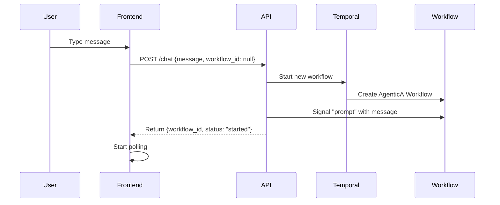
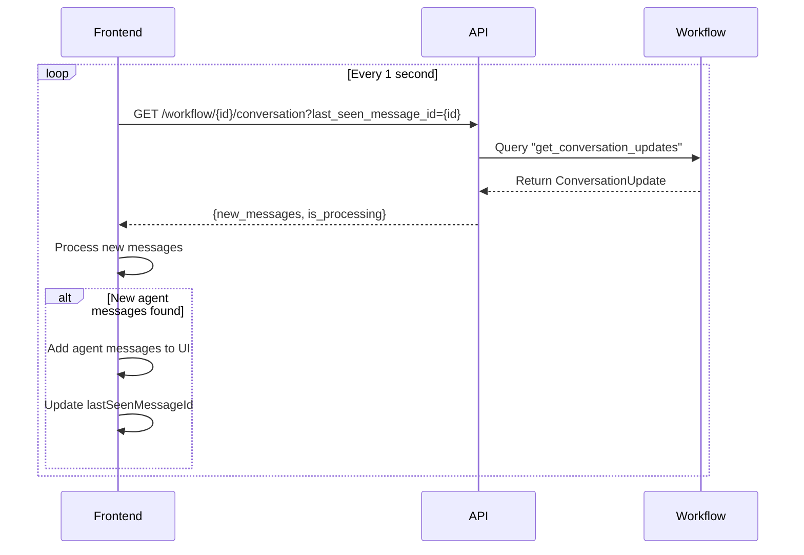
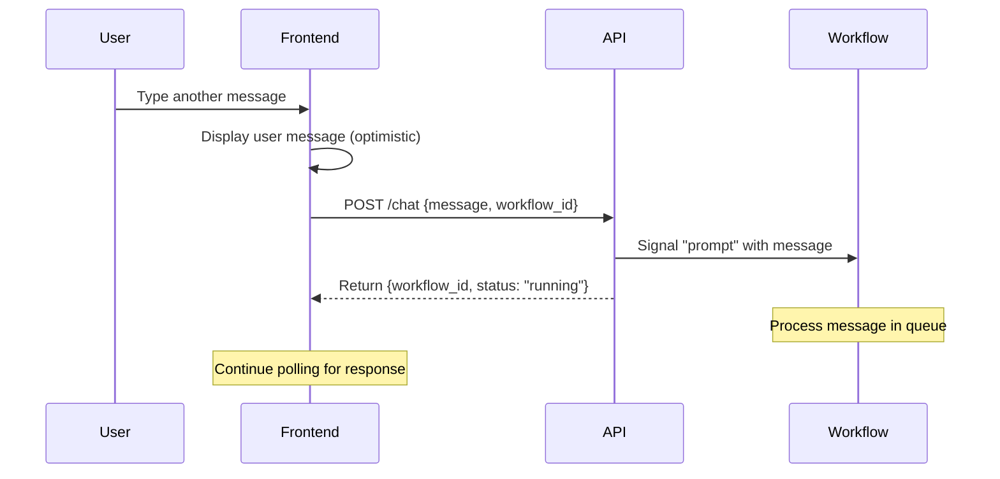
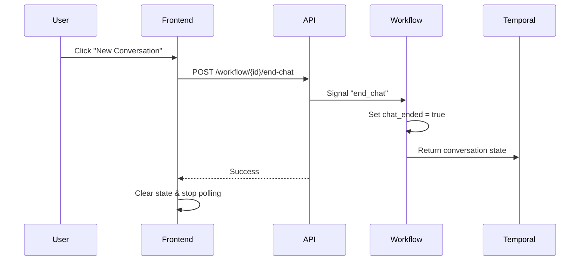

# Client Architecture Documentation

## Overview

The durable-ai-agent uses a React frontend that communicates with a FastAPI backend to manage Temporal workflows for AI-powered conversations. The architecture enables continuous, stateful conversations that persist across browser sessions.

## Key Components

### Frontend (React + Vite)

#### 1. **ChatView Component** (`frontend/src/views/ChatView.jsx`)
- Main UI component that renders the chat interface
- Uses the `useWorkflow` hook for all workflow interactions
- Displays messages and handles user input

#### 2. **useWorkflow Hook** (`frontend/src/hooks/useWorkflow.js`)
- Central state management for conversations
- Handles:
  - Message sending and receiving
  - Workflow lifecycle (start, poll, end)
  - Loading states and error handling
  - User name generation

#### 3. **API Service** (`frontend/src/services/api.js`)
- Thin wrapper around fetch API
- Endpoints:
  - `POST /chat` - Send messages and start workflows
  - `GET /workflow/{id}/status` - Get workflow status
  - `GET /workflow/{id}/conversation` - Get conversation updates
  - `GET /workflow/{id}/conversation/full` - Get full conversation
  - `POST /workflow/{id}/end-chat` - End conversations

### Backend (FastAPI + Temporal)

#### 1. **API Server** (`api/main.py`)
- RESTful endpoints for workflow management
- Routes requests to WorkflowService
- Handles CORS for frontend communication
- New conversation endpoints for incremental updates

#### 2. **WorkflowService** (`api/services/workflow_service.py`)
- Manages Temporal workflow lifecycle
- Key methods:
  - `process_message()` - Start workflow or send signal
  - `get_workflow_state()` - Query workflow status
  - `get_conversation_updates()` - Get incremental conversation updates
  - `send_message_signal()` - Send prompts to running workflows

#### 3. **AgenticAIWorkflow** (`workflows/agentic_ai_workflow.py`)
- Long-running Temporal workflow
- Signal-driven architecture:
  - `prompt` signal - Receive new messages
  - `end_chat` signal - Gracefully terminate
- Query handlers:
  - `get_conversation_state` - Full conversation state
  - `get_conversation_updates` - Incremental updates since last seen

## Message Flow

### 1. **Starting a Conversation**



### 2. **Polling for Responses**



### 3. **Continuing Conversation**



### 4. **Ending Conversation**



## State Management

### Frontend State (useWorkflow)
```javascript
{
  workflowId: string | null,        // Current workflow ID
  messages: Message[],              // All displayed messages (user and agent)
  isLoading: boolean,               // Loading state
  error: string | null,             // Error message
  workflowStatus: string | null,    // Workflow status from backend
  userName: string,                 // Generated user name
  seenMessageIds: useRef(Set)      // Tracks processed message IDs
}
```

### Workflow State (AgenticAIWorkflow)
```python
{
  prompt_queue: Deque[str],                    # Queued messages to process
  conversation_messages: List[ConversationMessage],  # All conversation turns
  chat_ended: bool,                            # Termination flag
  is_processing: bool,                         # Currently processing flag
  current_message_id: str | None,              # Message being processed
  trajectories: List[Trajectory]               # AI reasoning steps
}
```

### Message Models

#### ConversationMessage (Backend)
```python
class ConversationMessage(BaseModel):
    id: str                              # UUID for each conversation turn
    timestamp: datetime                  # When created
    user_message: str                    # User's input
    user_timestamp: datetime             # When user sent
    agent_message: Optional[str]         # Agent's response
    agent_timestamp: Optional[datetime]  # When agent responded
    tools_used: Optional[List[str]]      # Tools used in response
    processing_time_ms: Optional[int]    # Processing duration
    error: Optional[str]                 # Error if any
    is_complete: bool                    # Computed: has response or error
    is_error: bool                       # Computed: has error
```

#### Frontend Message
```javascript
{
  id: string,                    // Backend UUID or generated ID
  content: string,               // Message text
  role: 'user' | 'agent',        // Message role
  timestamp: string              // ISO timestamp
}
```

### API Response Structure

#### Status Endpoint
```json
{
  "workflow_id": "durable-agent-xxx",
  "status": "running",
  "query_count": 0,
  "last_response": {...},
  "message_count": 2,
  "latest_message": "Agent response text..."
}
```

#### Conversation Update
```json
{
  "workflow_id": "durable-agent-xxx",
  "conversation_update": {
    "new_messages": [
      {
        "id": "uuid-xxx",
        "user_message": "User input",
        "user_timestamp": "2025-07-28T...",
        "agent_message": "Agent response",
        "agent_timestamp": "2025-07-28T...",
        "is_complete": true,
        "tools_used": ["get_weather_forecast"]
      }
    ],
    "is_processing": false,
    "last_seen_message_id": "uuid-xxx"
  }
}
```

## Key Design Decisions

### 1. **Incremental Updates**
- Frontend polls with `last_seen_message_id` parameter
- Backend returns only new messages since that ID
- Reduces payload size and processing overhead
- Prevents duplicate message issues

### 2. **Optimistic UI Updates**
- User messages displayed immediately when typed
- No need to wait for backend confirmation
- Agent messages only come from backend API
- Clean separation of concerns

### 3. **UUID-Based Message IDs**
- Each conversation turn gets a unique UUID
- More robust than sequential integers
- Enables distributed systems compatibility
- No ID collision concerns

### 4. **Computed Fields**
- `is_complete` and `is_error` use Pydantic's `@computed_field`
- Ensures these fields are included in JSON responses
- Frontend can reliably check message completion status

### 5. **Simplified State Management**
- Simple array for messages (not Map)
- Set to track seen message IDs
- No complex deduplication logic
- Clear and maintainable code

## Configuration

### Environment Variables
- `VITE_API_URL` - API endpoint (defaults to relative URL)
- Development uses Vite proxy configuration
- Production uses nginx reverse proxy

### CORS Settings
- Configured in `api/main.py`
- Allows frontend origins: `localhost:3000`, `localhost:5173`

## Docker Deployment

### Frontend Container
- Built with multi-stage Dockerfile
- Node.js build stage compiles React app
- Nginx serves static files
- Rebuilds required for code changes

### Key Commands
```bash
# Rebuild frontend after changes
docker compose build frontend
docker compose up -d frontend

# Or force rebuild without cache
docker compose build --no-cache frontend
```

## Troubleshooting

### Common Issues

1. **Messages Not Displaying**
   - Hard refresh browser (Cmd+Shift+R)
   - Check browser console for errors
   - Verify API responses in Network tab
   - Ensure frontend container was rebuilt

2. **Duplicate Messages**
   - Should not occur with current design
   - Check `seenMessageIds` Set in console
   - Verify backend returns unique IDs

3. **Polling Errors**
   - Check CORS configuration
   - Verify API is accessible
   - Check for JavaScript errors

### Debug Tips
- Add console.log statements to track state
- Use Network tab to inspect API calls
- Check Docker logs: `docker compose logs -f frontend`
- Test API directly with curl or Postman

## Future Enhancements

1. **Real-time Updates**
   - Replace polling with WebSockets or SSE
   - Reduce latency and server load

2. **Message Persistence**
   - Store messages in database
   - Enable conversation history across sessions

3. **Authentication**
   - Add user authentication
   - Associate workflows with user accounts

4. **Rate Limiting**
   - Prevent abuse with message rate limits
   - Implement per-user quotas

5. **Conversation Management**
   - List active conversations
   - Resume previous conversations
   - Search conversation history