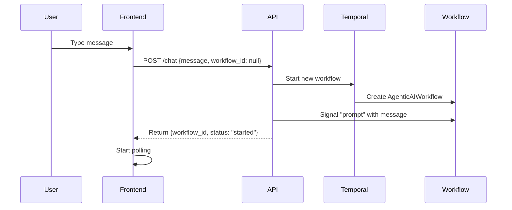
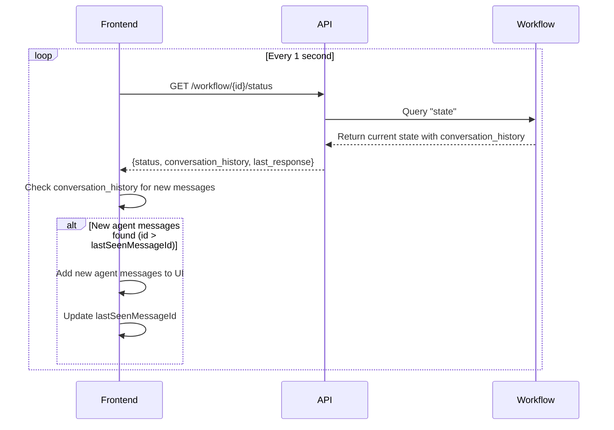
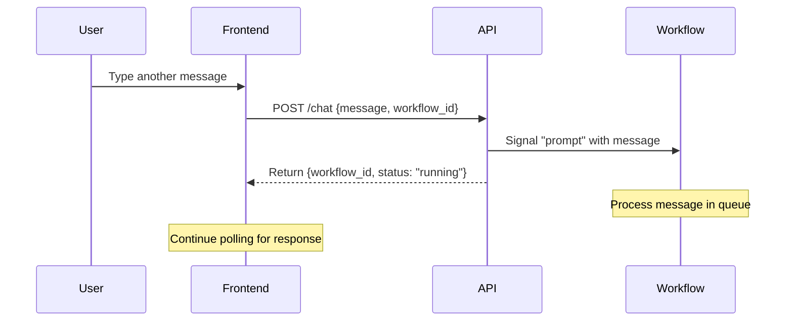
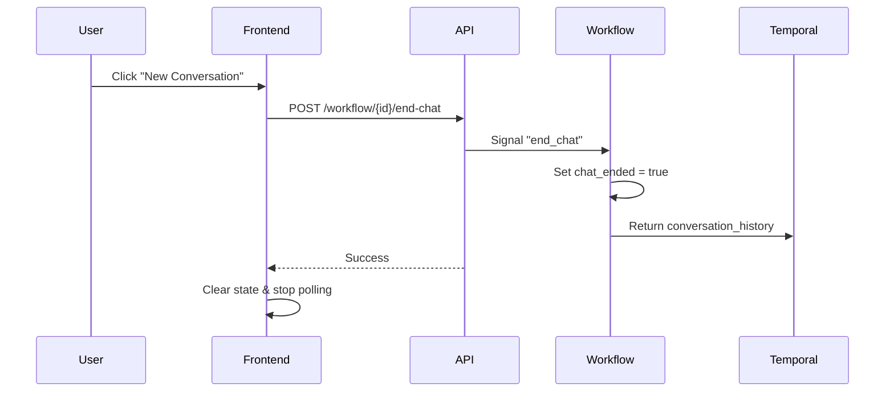

# Client Architecture Documentation

## Overview

The durable-ai-agent uses a React frontend that communicates with a FastAPI backend to manage Temporal workflows for AI-powered conversations. The architecture enables continuous, stateful conversations that persist across browser sessions.

## Key Components

### Frontend (React + Vite)

#### 1. **ChatView Component** (`frontend/src/views/ChatView.jsx`)
- Main UI component that renders the chat interface
- Uses the `useWorkflow` hook for all workflow interactions
- Displays messages and handles user input

#### 2. **useWorkflow Hook** (`frontend/src/hooks/useWorkflow.js`)
- Central state management for conversations
- Handles:
  - Message sending and receiving
  - Workflow lifecycle (start, poll, end)
  - Loading states and error handling
  - User name generation

#### 3. **API Service** (`frontend/src/services/api.js`)
- Thin wrapper around fetch API
- Endpoints:
  - `POST /chat` - Send messages and start workflows
  - `GET /workflow/{id}/status` - Poll for responses
  - `POST /workflow/{id}/end-chat` - End conversations

### Backend (FastAPI + Temporal)

#### 1. **API Server** (`api/main.py`)
- RESTful endpoints for workflow management
- Routes requests to WorkflowService
- Handles CORS for frontend communication

#### 2. **WorkflowService** (`api/services/workflow_service.py`)
- Manages Temporal workflow lifecycle
- Key methods:
  - `process_message()` - Start workflow or send signal
  - `get_workflow_state()` - Query workflow status
  - `send_message_signal()` - Send prompts to running workflows

#### 3. **AgenticAIWorkflow** (`workflows/agentic_ai_workflow.py`)
- Long-running Temporal workflow
- Signal-driven architecture:
  - `prompt` signal - Receive new messages
  - `end_chat` signal - Gracefully terminate
- Query handlers for state inspection

## Message Flow

### 1. **Starting a Conversation**



### 2. **Polling for Responses**



### 3. **Continuing Conversation**



### 4. **Ending Conversation**



## State Management

### Frontend State (useWorkflow)
```javascript
{
  workflowId: string | null,        // Current workflow ID
  messages: Message[],              // All displayed messages (user and agent)
  isLoading: boolean,               // Loading state
  error: string | null,             // Error message
  workflowStatus: string | null,    // Workflow status from backend
  userName: string,                 // Generated user name
  lastSeenMessageIdRef: useRef(0)   // Tracks highest message ID seen for deduplication
}
```

### Workflow State (AgenticAIWorkflow)
```python
{
  prompt_queue: Deque[str],              # Queued messages to process
  conversation_history: ConversationHistory,  # List[Message] with all messages
  chat_ended: bool,                      # Termination flag
  workflow_status: WorkflowStatus,       # Current processing status
  trajectories: List[Trajectory],        # AI reasoning steps
  message_id_counter: int                # Sequential message ID generator (starts at 0)
}
```

### Message Model
```python
class Message:
    id: int                         # Sequential ID (1, 2, 3, ...)
    role: MessageRole               # Enum: USER, AGENT, or SYSTEM
    content: str                    # Message text
    timestamp: datetime             # When created
    metadata: Dict[str, Any]        # Optional metadata

# Note: When serialized to JSON, role enum becomes string ("user", "agent", "system")
# via model_dump(mode='json') in the workflow's state query handler
```

### Message Roles
The system uses three distinct message roles:

- **USER**: Messages typed by the human user
  - Displayed immediately in the UI when typed
  - Sent to workflow via signal
  - Right-aligned in chat interface
  
- **AGENT**: Responses from the AI agent
  - Only retrieved from backend during polling
  - Generated after processing user messages
  - Left-aligned in chat interface
  
- **SYSTEM**: System-level messages (errors, status updates)
  - Used for workflow errors or system notifications
  - Currently not displayed in UI but available for future use

### Frontend Constants
```javascript
// constants/messageRoles.js
export const MESSAGE_ROLES = {
  USER: 'user',
  AGENT: 'agent',
  SYSTEM: 'system'
};
```

## Key Design Decisions

### 1. **Signal-Based Communication**
- Messages sent via Temporal signals (not direct RPC)
- Enables async processing and workflow persistence
- Workflows can handle multiple messages in sequence

### 2. **Polling Architecture**
- Frontend polls `/workflow/{id}/status` every second
- Returns `WorkflowState` with `conversation_history` field
- Simple and reliable for demo purposes
- Could be replaced with WebSockets/SSE in production

### 3. **Sequential ID-Based Deduplication**
- Each message gets a unique, incrementing ID from the workflow
- Frontend tracks `lastSeenMessageIdRef` - the highest ID displayed
- Only messages with `id > lastSeenMessageId` are added
- Prevents duplicates regardless of polling frequency
- More reliable than content-based deduplication

### 4. **Workflow Lifecycle**
- Workflows run continuously until explicitly ended
- Each conversation = one workflow instance
- New conversation properly ends previous workflow

### 5. **Error Handling**
- API errors displayed to user
- Polling continues through transient failures
- Workflow not found triggers new workflow creation

### 6. **Message Serialization**
- Backend uses Pydantic models with enum for MessageRole
- Workflow query handler uses `model_dump(mode='json')` for proper enum serialization
- Frontend receives role as string values ("user", "agent", "system")
- Ensures compatibility between Python enums and JavaScript strings

## Configuration

### Environment Variables
- `VITE_API_URL` - API endpoint (defaults to relative URL)
- Development uses Vite proxy configuration
- Production uses nginx reverse proxy

### CORS Settings
- Configured in `api/main.py`
- Allows frontend origins: `localhost:3000`, `localhost:5173`

## Testing Considerations

1. **Frontend Testing**
   - Mock API responses for unit tests
   - Test polling logic with various response scenarios
   - Verify deduplication works correctly

2. **Integration Testing**
   - Test full message flow end-to-end
   - Verify workflow signals are received
   - Test error scenarios (workflow not found, etc.)

3. **Load Testing**
   - Multiple concurrent conversations
   - High-frequency message sending
   - Long-running conversations

## Message Deduplication Deep Dive

The system uses sequential IDs to prevent duplicate messages when polling:

### Backend (Workflow)
1. **ID Assignment**: Each message gets `message_id_counter++` when created
2. **User Messages**: ID assigned when signal received (role: USER)
3. **Agent Messages**: ID assigned after processing completes (role: AGENT)
4. **Error Messages**: ID assigned when errors occur (role: AGENT)
5. **Query Response**: Returns last 10 messages with their IDs in `conversation_history`

### API Response Structure
```json
{
  "workflow_id": "durable-agent-xxx",
  "status": "running",
  "conversation_history": [
    {
      "id": 1,
      "role": "user",
      "content": "What's the weather?",
      "timestamp": "2025-07-27T04:54:39.383677Z"
    },
    {
      "id": 2,
      "role": "agent",
      "content": "The weather is...",
      "timestamp": "2025-07-27T04:54:41.281905Z"
    }
  ],
  "last_response": {...}
}
```

### Frontend (useWorkflow)
1. **User Input**: User messages displayed immediately (role: USER)
2. **Polling**: Polls `/status` endpoint for `conversation_history`
3. **ID Tracking**: `lastSeenMessageIdRef` stores highest ID seen
4. **Deduplication**: `if (msg.id > lastSeenMessageIdRef.current && msg.role === MESSAGE_ROLES.AGENT)`
5. **Display**: Only new agent messages (higher IDs) are added
6. **Reset**: On new conversation, `lastSeenMessageIdRef` resets to 0

### Benefits
- **Reliable**: Sequential IDs guarantee uniqueness
- **Efficient**: Simple integer comparison
- **Stateless**: Frontend doesn't need full history
- **Scalable**: Works with any polling frequency

## Future Enhancements

1. **Real-time Updates**
   - Replace polling with WebSockets or SSE
   - Reduce latency and server load

2. **Message Persistence**
   - Store messages in database
   - Enable conversation history across sessions

3. **Authentication**
   - Add user authentication
   - Associate workflows with user accounts

4. **Rate Limiting**
   - Prevent abuse with message rate limits
   - Implement per-user quotas

5. **Workflow Management**
   - List active workflows
   - Resume previous conversations
   - Bulk operations (end all, cleanup old)