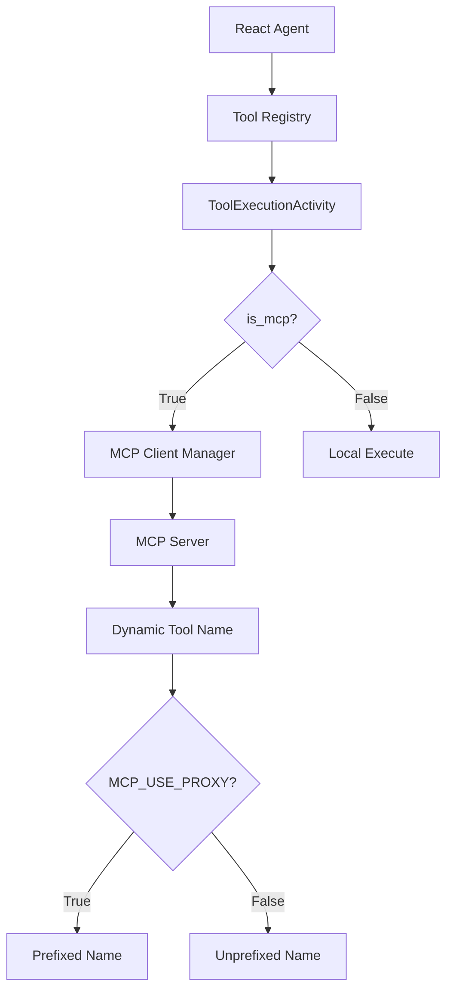

# MCP Tools Guide

This guide explains how to create and use MCP-enabled tools in the Durable AI Agent system.

## Overview

MCP (Model Context Protocol) tools allow the agentic workflow to execute tools via remote MCP servers rather than local Python code. This provides:

- **Distributed Execution**: Tools can run on separate servers or containers
- **Language Agnostic**: MCP servers can be written in any language
- **Better Scalability**: Tool execution can be scaled independently
- **Fault Isolation**: Tool failures don't crash the worker process

**IMPORTANT**: All weather/agriculture tools are now consolidated as MCP-enabled tools. There are no separate `_mcp` tools anymore.

## Architecture



## Creating an MCP Tool

### 1. Define the MCP Tool Class

```python
from typing import ClassVar, Type
from pydantic import BaseModel
from shared.tool_utils.mcp_tool import MCPTool

class MyTool(MCPTool):
    """Tool description for the agent."""
    
    # Required class variables
    NAME: ClassVar[str] = "my_tool"  # No _mcp suffix needed
    MODULE: ClassVar[str] = "tools.my_category.my_tool"
    is_mcp: ClassVar[bool] = True  # Identifies this as an MCP tool
    
    # Tool metadata
    description: str = "What this tool does"
    args_model: Type[BaseModel] = MyToolArgs
    
    # MCP configuration
    mcp_server_name: str = "my_server"  # Server namespace
    # Note: mcp_tool_name removed - computed dynamically based on MCP_USE_PROXY
    
    # get_mcp_config() is inherited from MCPTool base class
```

**IMPORTANT**: Tool names are now computed dynamically:
- When `MCP_USE_PROXY=true` (default): `my_server_my_tool`
- When `MCP_USE_PROXY=false`: `my_tool`

### 2. Tool Identification

MCP tools are identified by the `is_mcp` class variable, not by naming convention:

- Tools extending `MCPTool` automatically have `is_mcp = True`
- Tool names should be descriptive without special suffixes
- Examples: `get_weather_forecast`, `get_historical_weather`, `get_agricultural_conditions`

### 3. Reuse Argument Models

MCP tools should reuse the same argument models as their traditional counterparts:

```python
# Reuse argument models for consistency
from .weather_forecast import ForecastRequest

class WeatherForecastTool(MCPTool):
    args_model: Type[BaseModel] = ForecastRequest  # Same args as before
```

This ensures consistency when migrating from traditional to MCP tools.

## Registering MCP Tools

Register MCP tools in your tool set - they work alongside any traditional tools:

```python
class MyToolSet(ToolSet):
    def __init__(self):
        super().__init__(
            config=ToolSetConfig(
                name=self.NAME,
                description="My tools",
                tool_classes=[
                    # All tools registered the same way
                    WeatherForecastTool,      # MCP tool (is_mcp=True)
                    HistoricalWeatherTool,    # MCP tool (is_mcp=True)
                    SomeTraditionalTool,      # Traditional tool (is_mcp=False)
                ],
            )
        )
```

The workflow automatically routes based on the `is_mcp` class variable.

## Mock Mode

All MCP servers should support mock mode for testing:

### Environment Variable

Set `TOOLS_MOCK=true` to enable mock mode:

```bash
# In worker.env or .env
TOOLS_MOCK=true
```

### Server Implementation

```python
# In your MCP server
import os

MOCK_MODE = os.getenv("TOOLS_MOCK", "false").lower() == "true"

@server.tool
async def my_tool(request: MyRequest) -> dict:
    if MOCK_MODE:
        return get_mock_data(request)
    
    # Real implementation
    return await get_real_data(request)
```

## Testing MCP Tools

### Unit Tests

```python
def test_mcp_tool_creation():
    tool = MyTool()
    
    assert tool.NAME == "my_tool"
    assert tool.__class__.is_mcp is True
    assert tool.mcp_server_name == "my_server"
    
    # Test execute raises error
    with pytest.raises(RuntimeError):
        tool.execute(arg1="value")
```

### Integration Tests

```python
# With mock MCP server
async def test_mcp_tool_integration():
    # Start mock server
    # Create workflow with MCP tool
    # Verify tool execution via MCPExecutionActivity
```

## Workflow Routing

The workflow uses a unified `ToolExecutionActivity` that handles both traditional and MCP tools:

```python
# In ToolExecutionActivity
tool = tool_registry.get_tool(tool_name)
tool_class = tool.__class__

# Check if this is an MCP tool using the class variable
if getattr(tool_class, 'is_mcp', False):
    # Execute as MCP tool
    mcp_config = tool.get_mcp_config()
    client = await self.mcp_client_manager.get_client(mcp_config.server_definition)
    result = await client.call_tool(
        name=mcp_config.tool_name,  # Dynamically computed based on MCP_USE_PROXY
        arguments=wrapped_args
    )
else:
    # Execute as traditional tool
    result = tool.execute(**tool_args)
```

## Best Practices

1. **Use MCPTool Base Class**: Inherit from `MCPTool` for automatic MCP handling
2. **Reuse Argument Models**: Maintain consistency across tool implementations
3. **Support Mock Mode**: All servers should check `TOOLS_MOCK` environment variable
4. **Dynamic Tool Names**: Understand that tool names change based on `MCP_USE_PROXY`
5. **Proper Timeouts**: MCP tools may need longer timeouts for network calls
6. **Error Handling**: MCP servers should return structured error responses
7. **Environment Configuration**: Use `MCP_URL` and `MCP_USE_PROXY` for deployment flexibility

## Example: Weather Forecast Tool

```python
class WeatherForecastTool(MCPTool):
    """Get weather forecast for a location including temperature, precipitation, 
    wind, and other meteorological conditions."""
    
    NAME: ClassVar[str] = "get_weather_forecast"
    MODULE: ClassVar[str] = "tools.precision_agriculture.weather_forecast"
    is_mcp: ClassVar[bool] = True
    
    description: str = (
        "Get weather forecast for a location including temperature, precipitation, "
        "wind, and other meteorological conditions"
    )
    args_model: Type[BaseModel] = ForecastRequest
    
    # MCP configuration
    mcp_server_name: str = "forecast"
    # Note: Tool name is computed dynamically:
    # - Proxy mode (MCP_USE_PROXY=true): "forecast_get_weather_forecast"
    # - Direct mode (MCP_USE_PROXY=false): "get_weather_forecast"
```

## Troubleshooting

### Tool Not Found

If the agent can't find your MCP tool:
1. Check it's registered in the tool set
2. Verify the tool class extends `MCPTool`
3. Ensure the tool class is imported correctly
4. Check if `MCP_USE_PROXY` setting matches your deployment

### Tool Name Mismatch Errors

If you see "Unknown tool" errors:
1. Check `MCP_USE_PROXY` environment variable
2. Proxy mode expects prefixed names (e.g., `forecast_get_weather_forecast`)
3. Direct mode expects unprefixed names (e.g., `get_weather_forecast`)
4. Ensure MCP server implements the expected tool name

### Connection Errors

If MCP execution fails:
1. Verify the MCP server is running
2. Check `MCP_URL` environment variable
3. Ensure Docker networking allows connection
4. Check server logs for errors

### Mock Mode Not Working

If mock mode isn't activated:
1. Verify `TOOLS_MOCK=true` is set
2. Check server logs for mock mode message
3. Ensure server checks the environment variable