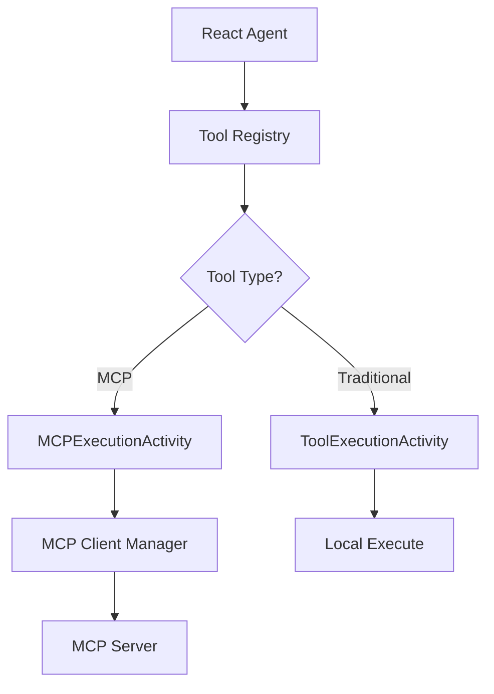

# MCP Tools Guide

This guide explains how to create and use MCP-enabled tools in the Durable AI Agent system.

## Overview

MCP (Model Context Protocol) tools allow the agentic workflow to execute tools via remote MCP servers rather than local Python code. This provides:

- **Distributed Execution**: Tools can run on separate servers or containers
- **Language Agnostic**: MCP servers can be written in any language
- **Better Scalability**: Tool execution can be scaled independently
- **Fault Isolation**: Tool failures don't crash the worker process

## Architecture



## Creating an MCP Tool

### 1. Define the MCP Tool Class

```python
from typing import ClassVar, Type
from pydantic import BaseModel
from models.tool_definitions import MCPServerDefinition
from shared.tool_utils.mcp_tool import MCPTool

class MyMCPTool(MCPTool):
    """Tool description for the agent."""
    
    # Required class variables
    NAME: ClassVar[str] = "my_tool_mcp"  # Must end with _mcp
    MODULE: ClassVar[str] = "tools.my_category.my_tool_mcp"
    
    # Tool metadata
    description: str = "What this tool does (mention MCP for clarity)"
    args_model: Type[BaseModel] = MyToolArgs  # Reuse from traditional tool
    
    # MCP configuration
    mcp_server_name: str = "my_server"  # Server namespace
    mcp_tool_name: str = "server_tool_name"  # Tool name on server
    mcp_server_definition: MCPServerDefinition = MCPServerDefinition(
        name="my-mcp-server",
        connection_type="http",
        url="http://my-server:8000/mcp"
    )
```

### 2. Naming Convention

MCP tools MUST follow the naming convention of ending with `_mcp`. This is how the workflow routes tools to the correct execution activity.

- ✅ `get_weather_forecast_mcp`
- ✅ `analyze_data_mcp`
- ❌ `get_weather_forecast_via_mcp`
- ❌ `mcp_get_weather`

### 3. Reuse Argument Models

MCP tools should reuse the same argument models as their traditional counterparts:

```python
# In traditional tool
from .weather_forecast import ForecastRequest

class WeatherForecastMCPTool(MCPTool):
    args_model: Type[BaseModel] = ForecastRequest  # Reuse!
```

This ensures consistency and allows tools to be swapped without changing the agent's behavior.

## Registering MCP Tools

Add MCP tools to your tool set alongside traditional tools:

```python
class MyToolSet(ToolSet):
    def __init__(self):
        super().__init__(
            config=ToolSetConfig(
                name=self.NAME,
                description="My tools (with MCP support)",
                tool_classes=[
                    # Traditional tools
                    TraditionalTool1,
                    TraditionalTool2,
                    # MCP tools
                    Tool1MCPTool,
                    Tool2MCPTool,
                ],
            )
        )
```

## Mock Mode

All MCP servers should support mock mode for testing:

### Environment Variable

Set `TOOLS_MOCK=true` to enable mock mode:

```bash
# In worker.env or .env
TOOLS_MOCK=true
```

### Server Implementation

```python
# In your MCP server
import os

MOCK_MODE = os.getenv("TOOLS_MOCK", "false").lower() == "true"

@server.tool
async def my_tool(request: MyRequest) -> dict:
    if MOCK_MODE:
        return get_mock_data(request)
    
    # Real implementation
    return await get_real_data(request)
```

## Testing MCP Tools

### Unit Tests

```python
def test_mcp_tool_creation():
    tool = MyMCPTool()
    
    assert tool.NAME == "my_tool_mcp"
    assert tool.uses_mcp is True
    assert tool.mcp_server_name == "my_server"
    
    # Test execute raises error
    with pytest.raises(RuntimeError):
        tool.execute(arg1="value")
```

### Integration Tests

```python
# With mock MCP server
async def test_mcp_tool_integration():
    # Start mock server
    # Create workflow with MCP tool
    # Verify tool execution via MCPExecutionActivity
```

## Workflow Routing

The workflow automatically routes tools based on naming:

```python
# In agentic_ai_workflow.py
if tool_name.endswith('_mcp'):
    # Route to MCPExecutionActivity
    result = await workflow.execute_activity(
        MCPExecutionActivity.execute_mcp_tool,
        request,
        start_to_close_timeout=timedelta(seconds=300),
    )
else:
    # Route to ToolExecutionActivity
    result = await workflow.execute_activity(
        ToolExecutionActivity.execute_tool,
        request,
        start_to_close_timeout=timedelta(seconds=30),
    )
```

## Best Practices

1. **Always End Names with _mcp**: This ensures proper routing
2. **Reuse Argument Models**: Maintain consistency with traditional tools
3. **Support Mock Mode**: All servers should check `TOOLS_MOCK`
4. **Clear Descriptions**: Mention "MCP" in tool descriptions
5. **Proper Timeouts**: MCP tools may need longer timeouts for network calls
6. **Error Handling**: MCP servers should return structured error responses

## Example: Weather Forecast MCP Tool

```python
class WeatherForecastMCPTool(MCPTool):
    """Weather forecast tool that uses MCP backend service."""
    
    NAME: ClassVar[str] = "get_weather_forecast_mcp"
    MODULE: ClassVar[str] = "tools.precision_agriculture.weather_forecast_mcp"
    
    description: str = (
        "Get weather forecast for a location using MCP service. "
        "Includes temperature, precipitation, wind, and other "
        "meteorological conditions from the weather proxy."
    )
    args_model: Type[BaseModel] = ForecastRequest
    
    # MCP configuration
    mcp_server_name: str = "forecast"
    mcp_tool_name: str = "forecast_get_weather_forecast"
    mcp_server_definition: MCPServerDefinition = MCPServerDefinition(
        name="weather-proxy",
        connection_type="http",
        url="http://weather-proxy:8000/mcp"
    )
```

## Troubleshooting

### Tool Not Found

If the agent can't find your MCP tool:
1. Check it's registered in the tool set
2. Verify the NAME ends with `_mcp`
3. Ensure the tool class is imported correctly

### Connection Errors

If MCP execution fails:
1. Verify the MCP server is running
2. Check the server URL in MCPServerDefinition
3. Ensure Docker networking allows connection
4. Check server logs for errors

### Mock Mode Not Working

If mock mode isn't activated:
1. Verify `TOOLS_MOCK=true` is set
2. Check server logs for mock mode message
3. Ensure server checks the environment variable